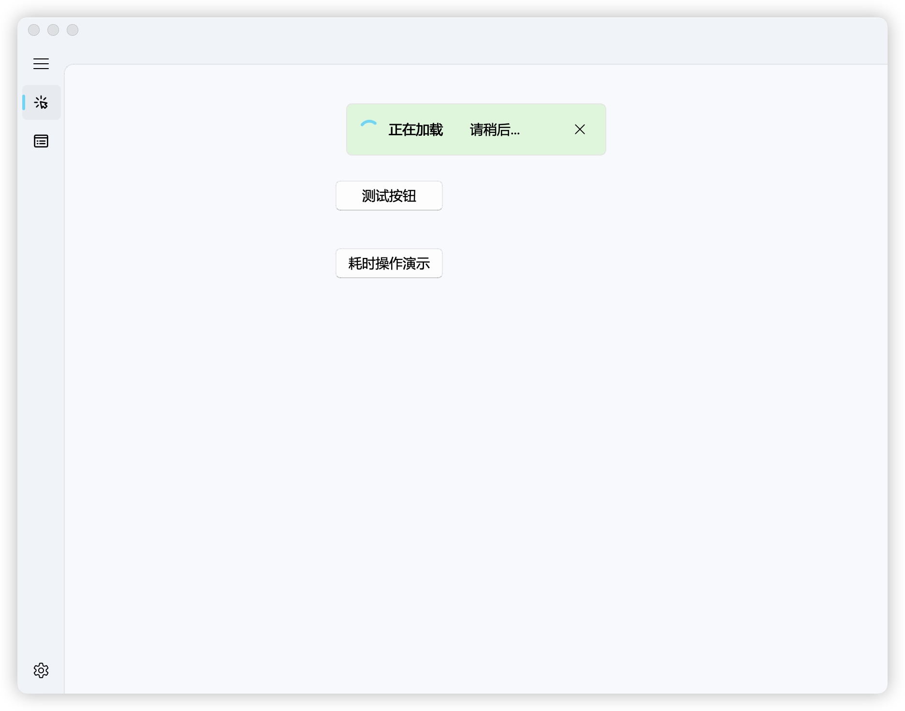
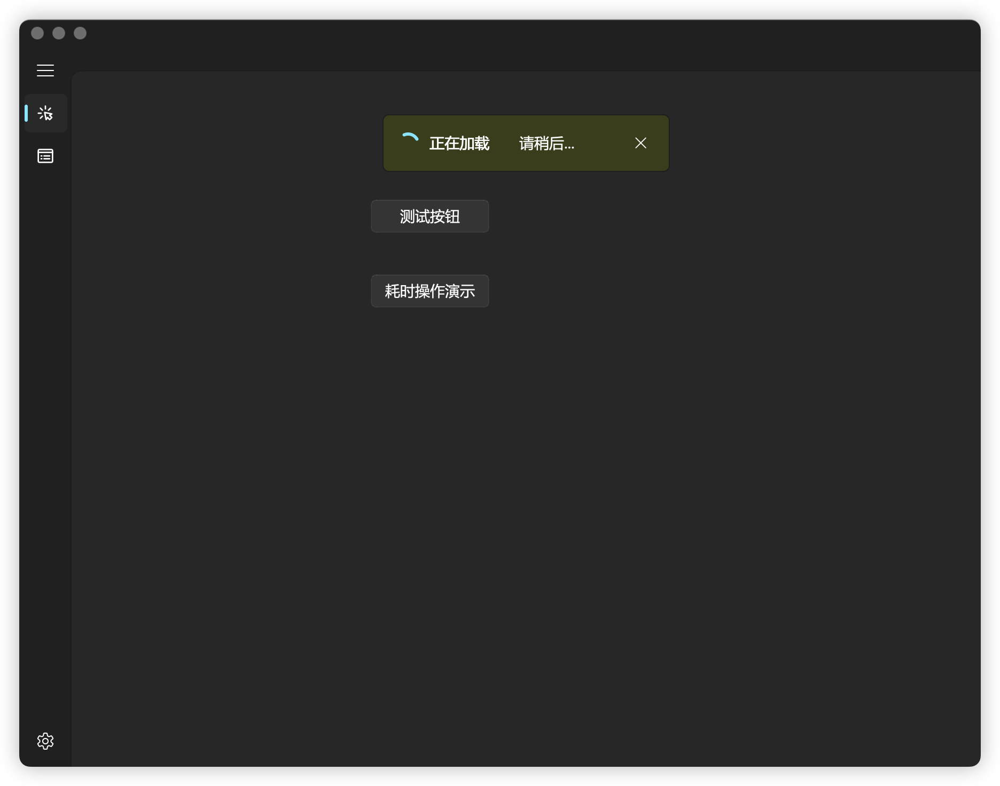

<h1 align="center">
  剪辑助手 · AutomatedEdit
</h1>

<div align="center">

**中文** | [English](./README_EN.md)

[]()
[]()
[]()
[](LICENSE)
[]()

</div>

面向短剧创作者的桌面端自动化剪辑工具。一体化完成
**视频下载 → AI 策划 → 语音识别 → 成片渲染 → 批量打码** 全流程，
并配套 FastAPI 服务端负责登录校验、每日配额、策划任务与版本更新下发。

## ✨ 主要特性

- 📥 **视频下载**：常读平台批量下载，Playwright 反爬指纹拟真、Cookie 编码修复、下载后自动解压
- ✂️ **自动化剪辑**：导入剧目后一键跑完「策划 → 识别 → 渲染」，支持失败自动重试与动态排队
- 🤖 **AI 策划**：按集卡点自动生成分片方案，支持 DeepSeek / 通义千问 / 小米 MiMo / 智谱 GLM 多通道（经服务端代理，密钥不落地客户端）
- 🎙 **语音识别**：FunASR 本地识别，自动生成字幕并驱动剪辑卡点
- 🎬 **硬件加速渲染**：自动检测并使用 NVIDIA NVENC / AMD AMF / Intel QSV，可切 CPU 软编码
- ⚡ **渲染引擎 v3**：三段式分块流复用 + 叠字预渲染，批量成片复用公共片段，大幅缩短出片时间
- 🩹 **批量打码**：多集视频三段式遮罩（含历史记录）批量处理
- 🎨 **现代化界面**：基于 qfluentwidgets 的 Fluent Design 风格，支持亮/暗主题
- 🏗 **MVVM + 依赖注入 + 懒加载**，逻辑与界面彻底分离

## 🧩 技术架构

| 组件 | 技术栈 | 说明 |
|------|--------|------|
| 桌面端 `app/` | PySide6 6.7.0 + pyside6-fluent-widgets | MVVM 架构、DI 容器、`LazyViewProxy` 懒加载 |
| 服务端 `server/` | FastAPI + MySQL + SQLAdmin | 登录校验 / 每日配额 / 策划任务 / 更新下发，管理后台 `/admin` |

服务端的接口与部署细节见 [server/README.md](./server/README.md)。

## 🖼 界面预览

| 登录界面 | 主界面（亮色） | 主界面（暗色） |
|---------|---------------|---------------|
|  |  |  |

## 🚀 快速开始

### 环境要求

1. Python **3.12**（由 `.python-version` 固定）
2. [uv](https://docs.astral.sh/uv/)（依赖与虚拟环境管理）
3. [FFmpeg](https://ffmpeg.org/)（渲染/转码；也可使用 `tools/ffmpeg/` 内置版本）
4. 可选：NVIDIA / AMD / Intel 显卡（开启硬件加速）

### 运行桌面端

```bash
# 克隆仓库
git clone https://github.com/manapameliahoii59-alt/AutomatedEdit.git
cd AutomatedEdit

# 安装依赖
uv sync

# 编译资源（.ts/.qrc/.ui，首次运行前必须执行）
uv run python scripts/pack_resources.py

# 启动桌面端
uv run python entry.py
```

> 服务端地址解析：源码开发环境默认连本地 `http://127.0.0.1:8000`；
> 打包安装后默认连正式服。也可在 `config.json` 的 `API.base_url` 或环境变量
> `AE_API_BASE_URL` 中覆盖。

### 运行服务端

服务端有独立依赖树，须在 `server/` 目录下启动（否则读不到 `.env`）：

```bash
cd server
cp .env.example .env      # 编辑数据库与密钥配置
pip install -r requirements.txt
uvicorn app.main:app --host 0.0.0.0 --port 8000
```

详见 [server/README.md](./server/README.md)。

## 🛠 开发流程

### UI 设计

1. 用 Qt Designer 打开/新建 `app/ui/generated/` 下的 `.ui` 文件
2. 添加或修改控件
3. 保存后重新编译资源：`uv run python scripts/pack_resources.py`

### 业务逻辑开发（MVVM）

1. **View**：在 `app/ui/views/<name>/view.py` 继承 `QWidget` 与 UI 类，仅负责初始化和信号绑定
2. **ViewModel**：同级 `view_model.py` 继承 `app.core.view_model.ViewModel`，用 `Signal` 通知 View，承载业务方法
3. **注册导航**：在 `app/ui/views/main_window/view.py` 用 `LazyViewProxy` 注册，实现按需加载

## 🧪 自动化测试

```bash
# 桌面端测试（默认开启覆盖率）
uv run pytest

# 服务端测试（须在 server/ 目录下运行）
cd server; pytest
```

测试结构：`tests/unit/`（单元）、`tests/integration/`（集成）、`tests/performance/`（性能）、`tests/security/`（安全）；服务端测试位于 `server/tests/`。

## 📦 项目打包

构建脚本基于 **Nuitka** 编译 + **Inno Setup** 生成安装包：

```bash
# 完整构建（Nuitka 编译，耗时较长）
uv run python scripts/build.py

# 一键生成安装包（含版本信息写入）
uv run python scripts/build.py --installer

# 日常极速打包：复用已编译底座，仅同步 app/ 业务代码（秒级）
uv run python scripts/build.py --app-only --fast-pack
```

也可手动执行 Inno Setup：`iscc scripts/pack_installer.iss`。

> ⚠️ 项目路径含非 ASCII 字符会破坏 Nuitka/ mingw 构建，请将仓库放在纯英文路径下。

## 🛠 项目结构

```
├── app/                    # 桌面端核心代码
│   ├── common/             # 通用工具 (Config, Logger, AES 等)
│   ├── core/               # 核心架构 (Container 依赖注入, Navigation 懒加载)
│   ├── data/               # 数据层 (API, Models, Services)
│   └── ui/                 # 界面层
│       ├── components/     # 自定义组件
│       ├── generated/      # .ui 编译生成的 Python 代码
│       └── views/          # 页面模块 (MVVM)
├── server/                 # FastAPI 服务端 (独立依赖树)
├── resource/               # 资源文件 (i18n, images, qss)
├── scripts/                # 构建与工具脚本
│   ├── build.py            # Nuitka 打包脚本
│   ├── pack_installer.iss  # Inno Setup 安装包配置
│   └── pack_resources.py   # 资源编译脚本
├── tools/                  # 内置 ffmpeg / 字体 / 片尾素材
├── tests/                  # 测试套件
├── entry.py                # 程序入口
├── pyproject.toml          # 项目配置与依赖
└── README.md
```

## ⚠️ 注意事项

> 本项目代码主要由 AI 辅助生成，建议作为学习参考使用；用于生产环境前请充分测试。

## 🙏 特别致谢

- **[PyQt-Fluent-Widgets / qfluentwidgets](https://github.com/zhiyiYo/PyQt-Fluent-Widgets)** — zhiyiYo 大佬的高质量 Fluent Design 组件库
